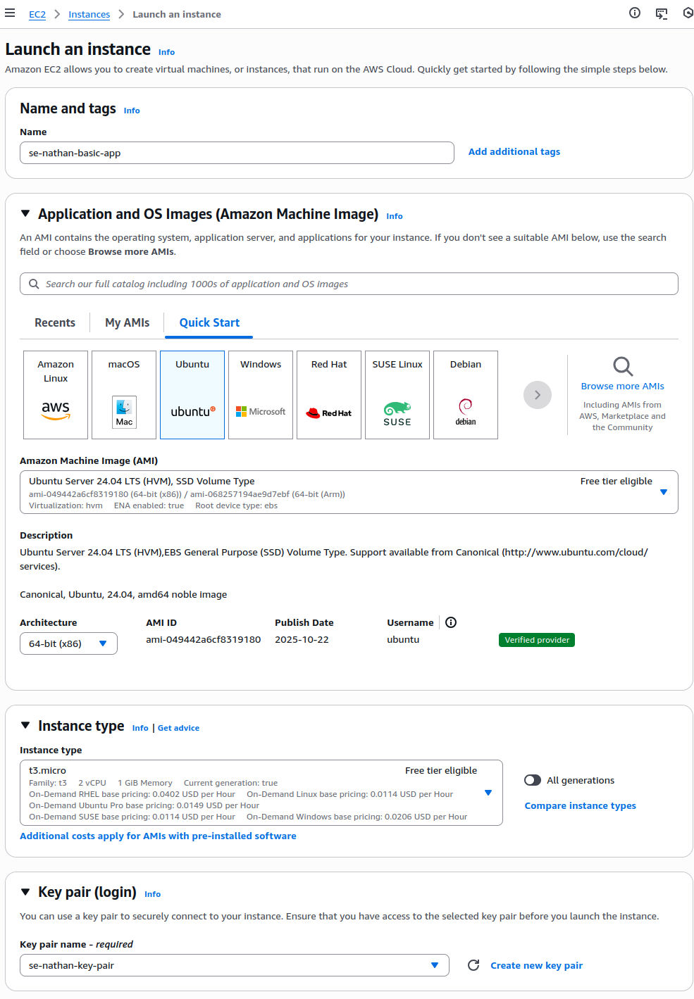
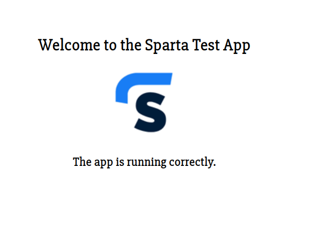

## this setup is done in a Ubuntu OS, for Windows use GitBash
1. depoyment environment specifications

    - hardware requirements:
        - EC2 instance type: t3.micro (free tier)
        - vCPU: 2 cores
        - memory: 1GB

    - operating system:
        - ubuntu server 24.04 LTS
        - 64-bit architecture

    - network configuration:
        - VPC: default
        - security group rules
            - inbound rules: HTTP (80), SSH (22),custom TCP (3000)
            - outbound rules: Allow  all traffic (0.0.0.0/0)

    - required infrastructure:
        - AWS EC2 instance

2. installation & configuration
    - create key pair:
        - on AWS, under EC2 create your own key pair
        - 

    - security group:
        - create your custom security group on EC2 with specifications defined in network config in section 1
        - 

    - instance setup:
        - in the EC2 section, create your instance using the specifications in section 1
        - 
        - for security group and key pair, use your previously created items

3. SSH connection & setup
    - download and move your key pair to your ssh folder (~/.ssh)
    - in terminal connect to instance:
        ssh -i ~/.ssh/your_key.pem ec2-user@your_instance_public_ip
    - once connected, update system:
        sudo apt update && sudo apt upgrade -y

    - intalling Node.js
        - run the command:
            # add node repo for node.js 20
            curl -fsSL https://deb.nodesource.com/setup_20.x | sudo -E bash -

            # install node.js
            sudo apt install -y nodejs

            # verify installation
            node -v
    - intalling nginx:
        sudo apt install nginx

4. application deployment
    - create application directory using:
        mkdir -p /home/ubuntu/app
    - copy over the test app .zip from **local** machine to EC2 instance:
        scp -i ~/.ssh/your_key.pem path/to/file.zip ubuntu@intance_public_ip:/home/ubuntu
    - back on the **instance**, unzip the file and move it:
        sudo apt install unzip
        unzip file.zip
        cp -r file/app/* /home/ubuntu/app
    - from here using **ls** in terminal, you can check if all files have been correctly copied
    - 
    
    # dependencies and process management
    - install node.js dependencies:
        npm install
    - globally install PM2:
        sudo npm install -g pm2
    - starting the application with PM2:
        pm2 start app.js --name sparta-test-app
        
    
    # nginx config for reverse proxy
    - remove default site:
        sudo rm /etc/nginx/sites-enabled/default
    - create new config:
        sudo nano/etc/nginx/sites-available/sparta-test-app
        # in the nano edit:
        server {
            listen 80;
            server_name _;

            location / {
                proxy_pass http://localhost:3000;
                proxy_http_version 1.1;
                proxy_set_header Upgrade $http_upgrade;
                proxy_set_header Connection 'upgrade';
                proxy_set_header Host $host;
                proxy_cache_bypass $http_upgrade;
            }
        }
    - enable the site:
        sudo ln -s /etc/nginx/sites-available/sparta-test-app /etc/nginx/sites-enabled/
        # if file already exists, continue with restarting

        - restart nginx and test configuration:
            sudo nginx -t
            sudo systemctl restart nginx

# when deployed
connect to the app via browser using http://public ip
the result should resemble the below image:
